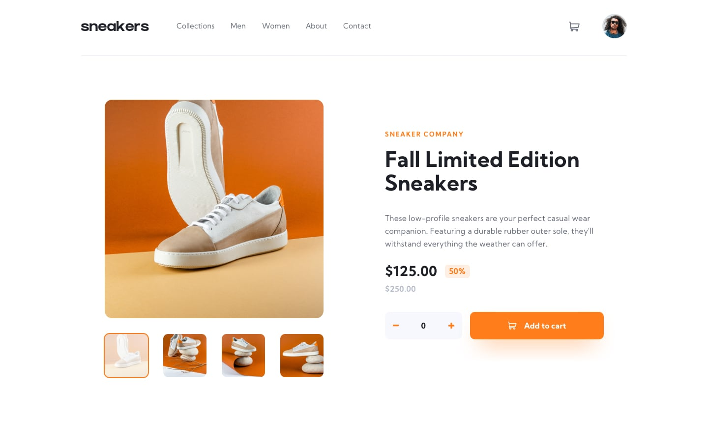

# E-commerce-product-page-app

## Description

Product page application made with react components and build with vite front-end tool, with some features:

- mobil responsive
- mobil menu
- light box images
- product picture slides
- shopping cart management

## Tools and libraries used

- fontawesome icons
- Bootstrap carousel component (customized)
- Google fonts

## React features used

- Function components
- Stateless function components
- Controlled components

## Other features

- Pagination
- Conditional styling
- Lifting statte up 

## Screenshots

